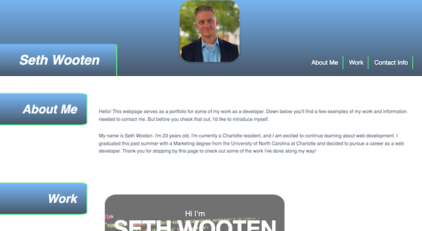

# Seth Wooten's Portfolio

## Table of Contents

1. [Description](#description)
2. [Visuals](#visuals)
3. [Deployment](#deployment)

## Description 

In this application, I utilized HTML and CSS to build a webpage that will serve as my portfolio. Using what we have learned, I was able to create a professional looking webpage with working links that is responsive to all viewports. Some of the links featured include internal links like links to specific sections on the page along with external links such as social media profiles.

## Visuals

## Deployment

[Link to live site](https://slwooten.github.io/slw-portfolio/)